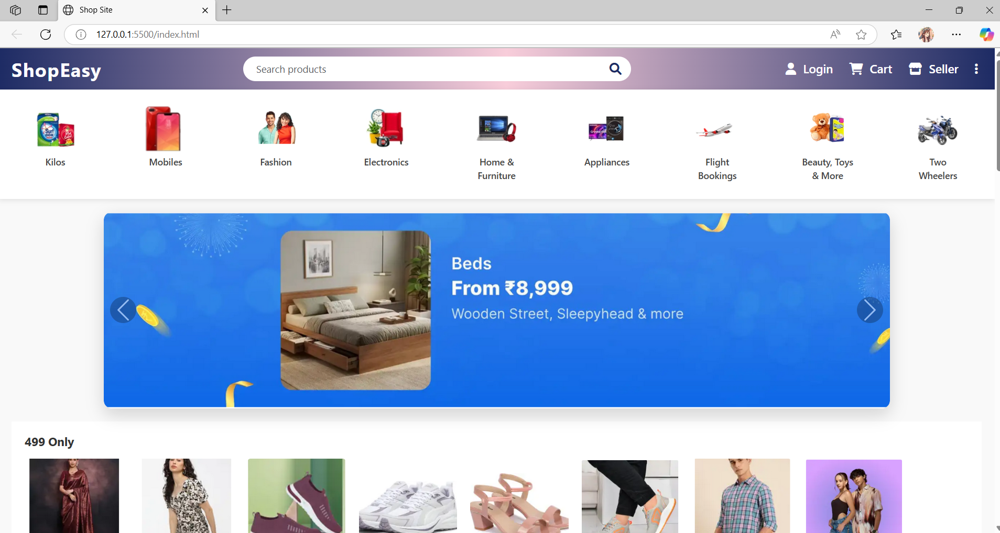

# ShopEasy 🛍️

ShopEasy is a simple and responsive frontend e-commerce website project. It features modern UI components like banners, category sliders, search bar, and product listings using only HTML and CSS.

## 🧾 Project Structure

```
ShopEasy/
├── images/         # Contains all image assets
├── index.html      # Main HTML file
├── style.css       # CSS for styling the website
└── README.md       # Project information
```

## 💡 Features

- Attractive gradient header and footer
- Responsive product / Banner sliders
- Category icons with hover effect
- Search bar with icon
- Promotional banners and offers
- Fully responsive design for mobile and desktop

## 🔧 Technologies Used

- HTML5
- CSS3 (Flexbox & Grid)
- Google Fonts (Segoe UI, Tahoma)
- Font Awesome (for icons, if used)

## 📷 Screenshots

This is how the ShopEasy looks:



## 📁 How to Use

1. Clone or download the repository.
2. Open the `index.html` file in any browser.
3. Make sure the `images` folder and `style.css` are in the correct structure.

## 📌 Notes

- No JavaScript is used in this project.
- Fully frontend-based, perfect for learning HTML/CSS layout and design (UI).

## 🙋‍♀️ Author

**Sakshi Gupta**  
B.Tech CSE | Shobhit University, Meerut  
GitHub: https://github.com/guptaasakshi [guptaasakshi]